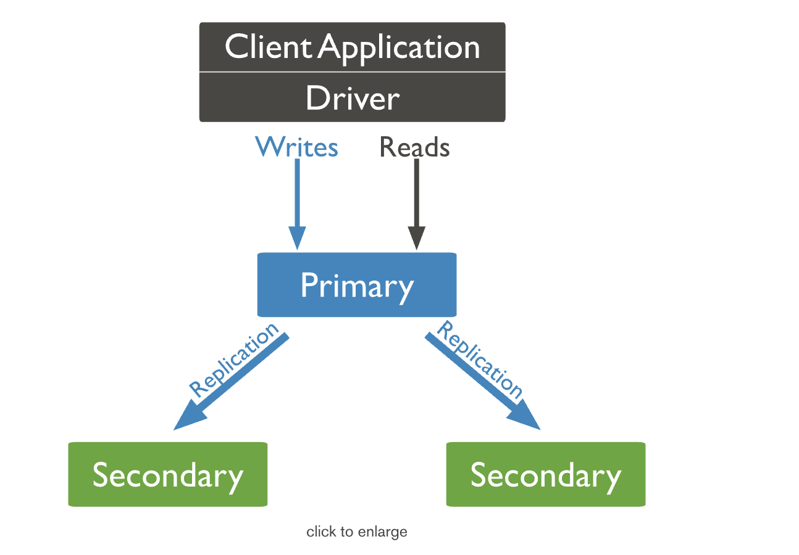

## Replication 
A _replica set_ in MongoDB is a group of **mongod** processes that maintain the same data set.
A replica set contains several data bearing nodes and optionally one arbiter node.

 Of the data bearing nodes, _one and only one member_ is deemed the primary node, while the other nodes are deemed secondary nodes.
 The primary node receives all write operations. A replica set can have only one primary capable of confirming writes with _{ w: "majority" }_ write concern

The secondaries replicate the primary's oplog and apply the operations to their data sets such that the secondaries' data sets reflect the primary's data set. If the primary is unavailable, an eligible secondary will hold an election to elect itself the new primary. 

In some circumstances (such as you have a primary and a secondary but cost constraints prohibit adding another secondary), you may choose to add a mongod instance to a replica set as an arbiter

## Asynchronous Replication
Secondaries replicate the primary's oplog and apply the operations to their data sets asynchronously.

### Slow Operations
Starting in version 4.2 (also available starting in 4.0.6), secondary members of a replica set now log oplog entries that take longer than the slow operation threshold to apply.

## Replication Lag and Flow Control
Replication lag refers to the amount of time that it takes to copy (i.e. replicate) a write operation on the primary to a secondary. Some small delay period may be acceptable, but significant problems emerge as replication lag grows, including building cache pressure on the primary.

## Automatic Failover
When a primary does not communicate with the other members of the set for more than the configured electionTimeoutMillis period (10 seconds by default), an eligible secondary calls for an election to nominate itself as the new primary. The cluster attempts to complete the election of a new primary and resume normal operations.

_The replica set cannot process write operations until the election completes successfully. The replica set can continue to serve read queries if such queries are configured to run on secondaries while the primary is offline._

Your application connection logic should include tolerance for automatic failovers and the subsequent elections. Starting in MongoDB 3.6, MongoDB drivers can detect the loss of the primary and automatically retry certain write operations a single time, providing additional built-in handling of automatic failovers and elections:

- MongoDB 4.2+ compatible drivers enable retryable writes by default
- MongoDB 4.0 and 3.6-compatible drivers must explicitly enable retryable writes by including retryWrites=true in the connection string.

Starting in version 4.4, MongoDB provides mirrored reads to pre-warm electable secondary members' cache with the most recently accessed data. Pre-warming the cache of a secondary can help restore performance more quickly after an election.

## Read Operations
By default, clients read from the primary [1]; however, clients can specify a read preference to send read operations to secondaries.

Asynchronous replication to secondaries means that reads from secondaries may return data that does not reflect the state of the data on the primary.

###### More info: 
- https://docs.mongodb.com/manual/replication/
- https://docs.mongodb.com/manual/applications/replication/ 
- https://docs.mongodb.com/manual/reference/write-concern/ 
- https://docs.mongodb.com/manual/reference/read-concern/ 
